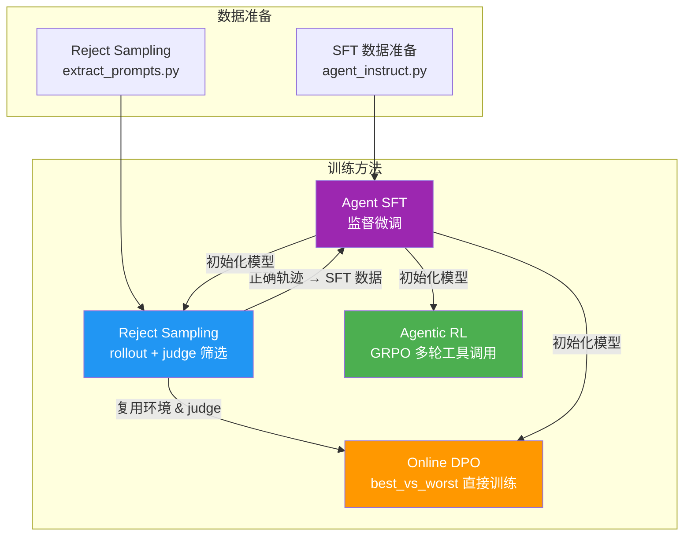

# Agentic RL — Multi-turn Tool Calling with GRPO

用 verl 框架对 Qwen3 模型进行多轮工具调用（agentic）强化学习训练。Agent 在真实工具环境中进行 rollout，通过 GRPO 算法优化，学习在 `<think>` 中推理、调用 `calculator`/`search` 等工具、并通过 `submit_answer` 提交带置信度的最终答案。

## 目录结构

```
Rl_Specilist/agent/RL/
├── config/
│   └── agentic_grpo.yaml          # GRPO 训练配置（Hydra config）
├── data_preprocess/
│   ├── prepare_math_multiturn.py  # GSM8K / MATH 多轮工具调用数据生成
│   └── prepare_qa_search.py       # QA / Search 场景数据生成
├── reward/
│   └── agentic_reward.py          # 多维复合奖励函数
├── tools/
│   ├── calculator_tool.py         # 计算器工具（精确算术）
│   ├── answer_submit_tool.py      # 答案提交工具（带置信度）
│   └── tool_config.yaml           # 工具注册配置
├── test_smoke.py                  # 冒烟测试（模块导入 + 基础功能）
└── run_agentic_rl.sh              # 训练启动脚本
```

## 快速开始

### 1. 准备数据

```bash
# GSM8K 多轮数据
python -m Rl_Specilist.agent.RL.data_preprocess.prepare_math_multiturn

# (可选) QA/Search 数据
python -m Rl_Specilist.agent.RL.data_preprocess.prepare_qa_search
```

### 2. 启动训练

```bash
bash Rl_Specilist/agent/RL/run_agentic_rl.sh 8 ./ckpt/agentic_rl gsm8k
```

参数说明：
- `nproc_per_node`：每个节点的 GPU 数量（如 `8`）
- `save_path`：checkpoint 保存路径
- `dataset`：数据集选择（`gsm8k` | `math` | `qa`，默认 `gsm8k`）
- 后续可追加 Hydra 配置覆盖，如 `trainer.total_epochs=5`

环境变量：

| 变量 | 默认值 | 说明 |
|------|--------|------|
| `MODEL_PATH` | `Qwen/Qwen3-1.7B` | 基座模型路径 |
| `DATA_ROOT` | `$HOME/data` | 数据根目录 |
| `PROJECT_NAME` | `agentic-rl` | wandb 项目名 |
| `EXPERIMENT_NAME` | `agentic-grpo-<timestamp>` | 实验名 |

## 奖励函数设计

奖励函数 `agentic_reward.py` 实现了 [reward_priciple.md](../SFT/doc/reward_priciple.md) 中定义的多维奖励结构：

```
R = R_answer
  + w_cal   * R_calibration
  + w_verify * R_verify
  + w_proc  * R_process
  + w_epi   * R_epistemic
  - w_tool  * R_tool_cost
  - w_safe  * R_safety
```

### 各维度说明

| 维度 | 权重 | 说明 |
|------|------|------|
| `answer` | 1.0 | 答案正确性：正确 +1.0，错误 -0.2，未答 0.0 |
| `calibration` | 0.2 | Brier score 校准：`-(confidence - is_correct)²` |
| `verify` | 0.2 | 验证行为：提交前使用工具 +0.2，修正后正确 +0.5 |
| `process` | 0.3 | 过程质量：工具级 step reward 聚合 + 推理块奖励 |
| `epistemic` | 0.2 | 认知校准：知道/不知道时行为是否正确 |
| `tool_cost` | 0.1 | 工具成本：按类型分层计费，超出 free budget 后扣分 |
| `safety` | 1.0 | 安全惩罚：检测虚假引证、虚假验证、工具幻觉 |

### 工具分层成本

| 工具 | 每次调用成本 |
|------|------------|
| `calculator` | 0.01（几乎免费） |
| `search` | 0.05（中等） |
| `browser` | 0.1 |
| `python` | 0.2 |
| `submit_answer` | 0.0（提交免费） |

Free budget = 2 次调用，超出后才计入成本。

## 训练配置要点

- **算法**：GRPO（Group Relative Policy Optimization）
- **Rollout**：SGLang 引擎，每 prompt 采样 `n=8` 个响应
- **温度**：`1.0`，鼓励多样性
- **多轮**：最多 6 轮 assistant turn，Hermes 格式
- **KL 惩罚**：`kl_loss_type=low_var_kl`，系数 `0.001`
- **优化器**：AdamW，lr=`1e-6`，weight_decay=`0.1`
- **训练轮数**：15 epochs

## 冒烟测试

验证模块导入和基础功能：

```bash
python Rl_Specilist/agent/RL/test_smoke.py
```

## 与 Agent SFT / Reject Sampling / Online DPO 的关系



- **Agent SFT**：用优质 agent 轨迹做监督微调，建立基础行为模式
- **Reject Sampling**：用当前模型 rollout，API judge 筛选正确轨迹，转 SFT 数据
- **Online DPO**：替代 Reject Sampling，直接在 RL 训练中采样 best/worst 对做 DPO
- **Agentic RL (本目录)**：用 GRPO 做完整 RL 训练，最大化多维复合奖励

## 依赖

- verl 框架（`verl.trainer.main_ppo`）
- SGLang（rollout 引擎）
- Qwen3 系列模型
- 数据需预先处理为 Parquet 格式
